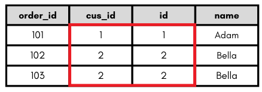
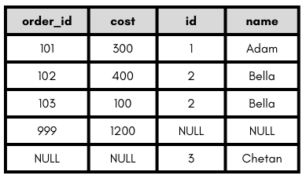
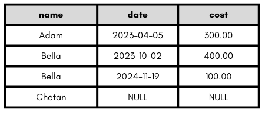
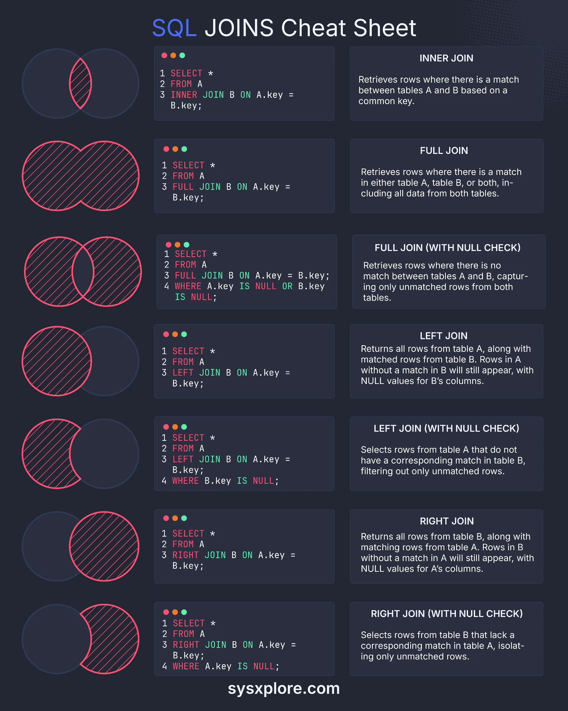

## Intro
Databases come in two different types: 
* Relational (SQL)
  *  Must follow clearly predefined fixed table format (schema) with rows and columns
  *  Ensures data integrity and consistency through relationships via primary and foreign keys
* Non - relational (NoSQL)
  *  Data can be stored in flexible dynamic formats - documents (JSON), key-value pair, graphs
  *  Scalability and availability are prioritised over integrity and consistency

Object-Relational Mapping (ORM) is a programming technique that can facilitate data interaction between 
object-orientated programming languages and relational databases. 

## SQL
### CRUD

Customers Table

| id  | name   | age  | city      | country | has_subscription |
|-----|--------|------|-----------|---------|------------------|
| 1   | Adam   | 58   | New York  | USA     | TRUE             |
| 2   | Bella  | NULL | Tijuana   | Mexico  | FALSE            |
| 3   | Chetan | 36   | New Delhi | India   | TRUE             | 

Orders Table 

| id | cus_id | order_date       | cost   | discount | status    |
|----|--------|------------|--------|----------|-----------|
| 101 | 1      | 2023-04-05 | 300.00 | 0.00     | Delivered |
| 102 | 2      | 2023-10-02 | 400.00 | 0.00     | Shipped   |
| 103 | 2      | 2024-11-19 | 100.00 | 25.35    | TBD       |
| 999 | NULL   | 2027-06-16 | 1200   | 0.00     | TBD       |

Films Table

| title                         | duration | rating |
|-------------------------------|----------|--------|
| Guardians of the Galaxy       | 121      | 12A    |
| You Only Live Twice           | 117      | PG     |
| I Know What You Did Last Summer | 101      | 18     |


#### Create table
```sql
CREATE TABLE customers (
    id NUMBER GENERATED ALWAYS AS IDENTITY PRIMARY KEY, //GENERATED ALWAYS AS IDENTITY auto-increments the ID
    name VARCHAR2(255),
    age NUMBER,
    city VARCHAR2(255),
    country VARCHAR2(255),
    has_subscription VARCHAR2(255)
);

CREATE TABLE orders (
    id NUMBER GENERATED ALWAYS AS IDENTITY PRIMARY KEY,
    cus_id NUMBER,
    order_date DATE,
    cost NUMBER,
    discount NUMBER,
    status VARCHAR2(255),
    FOREIGN KEY (cus_id) REFERENCES customers(id)
);

```
)

#### INSERT
```sql
INSERT INTO customers (name, age, city, country, has_subscription) VALUES ('Adam', 58, 'New York', 'USA','TRUE');
INSERT INTO customers (name, age, city, country, has_subscription) VALUES ('Bella', NULL, 'Tijuana', 'Mexico', 'FALSE');
INSERT INTO customers (name, age, city, country, has_subscription) VALUES ('Chetan', 36, 'New Delhi', 'India','TRUE');

INSERT INTO orders (cus_id, order_date, cost, discount, status) VALUES (1, TO_DATE('2023-04-05', 'YYYY-MM-DD'), 300.00, 0.00,'Delivered');     
INSERT INTO orders (cus_id, order_date, cost, discount, status) VALUES (2, TO_DATE('2023-10-02', 'YYYY-MM-DD'), 400.00, 0.00,'Shipped');
INSERT INTO orders (cus_id, order_date, cost, discount, status) VALUES (2, TO_DATE('2024-11-19', 'YYYY-MM-DD'), 100.00, 25.35,'TBD');
INSERT INTO orders (cus_id, order_date, cost, discount, status) VALUES (NULL, TO_DATE('2027-06-16', 'YYYY-MM-DD'), 1200.00, 0.00,'TBD');
```

**NOTE** - Single quotes `'` not double quotes `"` around string literals which Oracle SQL expects

#### READ
```sql
SELECT * FROM customers;
SELECT * FROM orders;

SELECT name,age FROM customers;
SELECT name,age FROM customers WHERE age > 50;

SELECT * FROM films WHERE title LIKE 'You%'; -- Matches any movie where "You" is at the start of the title
SELECT * FROM films WHERE title LIKE '%You%'; -- Matches any movie with "You" anywhere in the title
SELECT * FROM films WHERE LOWER(title) LIKE LOWER('%The%'); -- Matches any movie case insensitive

SELECT * FROM films ORDER BY duration DESC;
SELECT * FROM films ORDER BY duration ASC;

```
```sql
SELECT COUNT (*) FROM films;
SELECT DISTINCT rating FROM films;
SELECT COUNT (DISTINCT rating) FROM films;
SELECT rating, COUNT(*) FROM films GROUP BY rating;
SELECT rating, AVG(duration) FROM films GROUP BY rating;
SELECT name FROM customers WHERE country in ('USA','Canada','Mexico');
```

```sql
SELECT COUNT (*) FROM games 
WHERE division_code = (
    SELECT code 
    FROM divisions 
    WHERE name = 'Bundesliga'
)
AND home_team = 'Freiburg' OR away_team = 'Freiburg'
```


```sql
SELECT COUNT (*) FROM games 
WHERE division_code = (
    SELECT code 
    FROM divisions 
    WHERE name = 'Eredivisie'
)
AND season BETWEEN 2010 AND 2015
AND ftr = 'D';
```

```sql
SELECT games.* , (fthg + ftag) AS total_goals 
FROM games 
WHERE division_code = (
    SELECT code from divisions 
    WHERE name = 'Premier League'
)
ORDER BY total_goals DESC, fthg DESC;
```
```sql
SELECT divisions.name, games.season, SUM(fthg + ftag) AS total_goals
FROM games
INNER JOIN divisions
ON games.division_code = divisions.code
GROUP BY divisions.name, games.season
ORDER BY total_goals DESC
FETCH first 5 ROWS ONLY;
```

#### UPDATE
```sql
UPDATE customers SET name = 'Bella', age = 42 WHERE id = 2;
```

#### DELETE
```sql
INSERT INTO orders (cus_id, order_date, cost, discount, status) VALUES (NULL, NULL, NULL, NULL, NULL);
DELETE FROM orders WHERE id = 5;
```

### JOIN
#### INNER JOIN - returns rows that have matching values in both tables
```sql
SELECT orders.id, orders.cus_id, customers.id,customers.name
FROM orders
INNER JOIN customers
ON orders.cus_id = customers.id;
```


#### FULL JOIN - returns all rows from both tables, if there's no match, NULL is returned
```sql
SELECT orders.id, orders.cus_id, customers.id,customers.name
FROM orders
FULL OUTER JOIN customers
ON orders.cus_id = customers.id;
```


#### LEFT JOIN - returns all rows from the left table, and the matched rows from the right. If no matches, NULL is returned for the right table
```sql
SELECT customers.name, orders.order_date, orders.cost
FROM customers
LEFT JOIN orders
ON customers.id= orders.cus_id;
```



